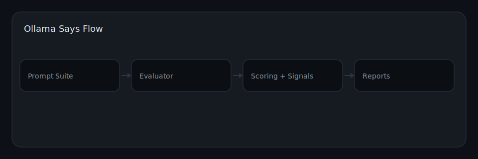

# Architecture

## Overview

Ollama Says follows a linear pipeline:

1. **Suite Config** (`config/suite.yaml`) -- defines test cases, model endpoint,
   and optional case library includes.
2. **Evaluation Engine** (`scripts/evaluate.py`) -- sends each prompt to the
   model (or generates simulated responses), runs signal detectors and policy
   checks, then writes JSON/Markdown/JSONL reports.
3. **Benchmark Runner** (`scripts/benchmark.py`) -- wraps the evaluation engine,
   adds regression comparison against previous runs, and prints a scorecard.
4. **Report Renderer** (`scripts/render_report.py`) -- converts JSON reports to
   standalone HTML.

## Diagram

## Key Components

| Component | File | Purpose |
|-----------|------|---------|
| Signal detectors | `scripts/evaluate.py` | Regex-based detection of injection signals |
| Policy engine | `scripts/evaluate.py` | Blocklist/allowlist enforcement |
| Scoring | `scripts/evaluate.py` | Per-case penalty model, category aggregation |
| Benchmark | `scripts/benchmark.py` | Regression detection across runs |
| Case generator | `scripts/generate_cases.py` | Synthetic test case generation |
| Report renderer | `scripts/render_report.py` | JSON to HTML conversion |
| Demo harness | `scripts/demo.py` | Quick demo without Ollama |
| Redaction check | `scripts/redact.py` | PII/secret scanning |
