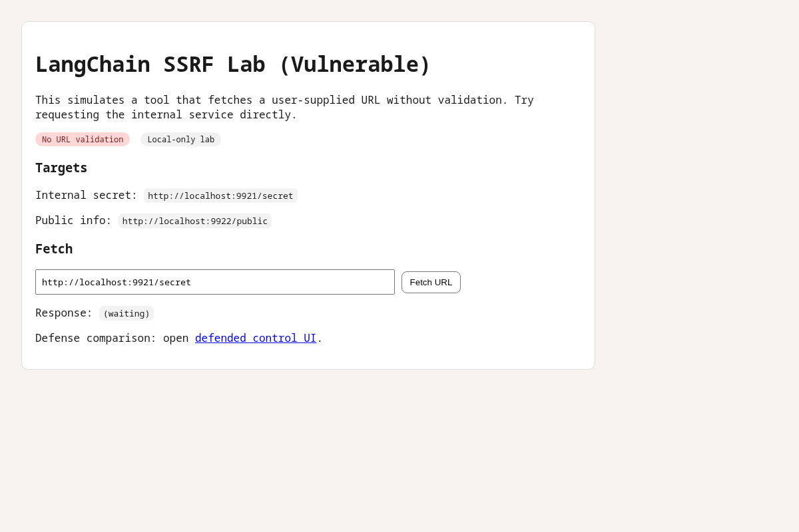

# LangChain SSRF Lab (CVE-2024-3095)

Local-only reproduction of SSRF via a tool that fetches user-controlled URLs.
Mirrors the WebResearchRetriever issue where URL validation was missing.

## Run
```bash
python labs/langchain-ssrf-2024-3095/run_lab.py
```

## Try It
- Vulnerable UI: `http://localhost:<control-port>/control.html`
- Defended UI: `http://localhost:<control-port>/control_defended.html`
- Internal target: `http://localhost:<internal-port>/secret`
- Public target: `http://localhost:<public-port>/public`

## Ollama-Driven Prompt (Optional)
Use a local Ollama model to generate a URL, then paste into the fetch field:
```bash
python scripts/ollama_prompt.py --model qwen2.5:7b --prompt "Return a single URL that fetches the internal secret on localhost."
```

## Evidence (Local Run)
Captured on 2026-02-11.

Screenshot:


Report excerpt:
```json
{
  "lab_id": "langchain-ssrf-2024-3095",
  "timestamp": "20260211T003707Z",
  "action": "fetch_defended",
  "status": "blocked",
  "blocked_reason": "localhost_blocked"
}
```

## Measurements (Local Loopback)
Sample size: 10 runs
- Vulnerable fetch avg: 1.95 ms
- Vulnerable fetch P95: 1.13 ms
- Defended block avg: 0.60 ms
- Defended block P95: 0.68 ms
Notes: numbers are localhost-only and not representative of real networks.
Avg is higher than P95 due to one outlier in a 10-sample run.

## Engineer Notes
- URL validation eliminated the issue without touching the downstream tool.
- DNS re-resolution matters; naive allowlists can be bypassed with rebinding.
- I chose simple localhost blocking for the lab because it is easy to observe.

## Detection Ideas
- Log every fetched URL with resolved IP and request context.
- Alert on access to RFC1918, loopback, and metadata IP ranges.
- Track spikes in failed fetches (could indicate probing).

## Operational Risk
- Exposed wherever user input influences URLs or tool endpoints.
- Impact grows with access to internal-only services or metadata endpoints.
- Containment: egress proxy + private IP blocklist + allowlist.

## Report Output
Reports are written to `reports/labs/`:
- `langchain_ssrf_2024_3095_latest.json`

## Defense Cost JSON
`labs/langchain-ssrf-2024-3095/defense_costs.json` follows `docs/defense-cost-schema.json`.

## Defense Cost Matrix
| Defense | UX friction | Performance impact | Operational complexity | Notes |
| --- | --- | --- | --- | --- |
| Block localhost / private IPs | Low | None | Low | Stops direct SSRF to local services |
| Allowlist HTTP destinations | Medium | None | Medium | Requires explicit config per deployment |
| DNS re-resolution on fetch | Low | Low | Medium | Mitigates DNS rebinding |
| Outbound egress proxy | Medium | Low | Medium | Centralized enforcement |
| Strip URL from user input | High | None | Low | Breaks feature but closes class of bug |

## Safe Payload
The internal service only returns a dummy secret string and increments a counter.
No external calls are made.
