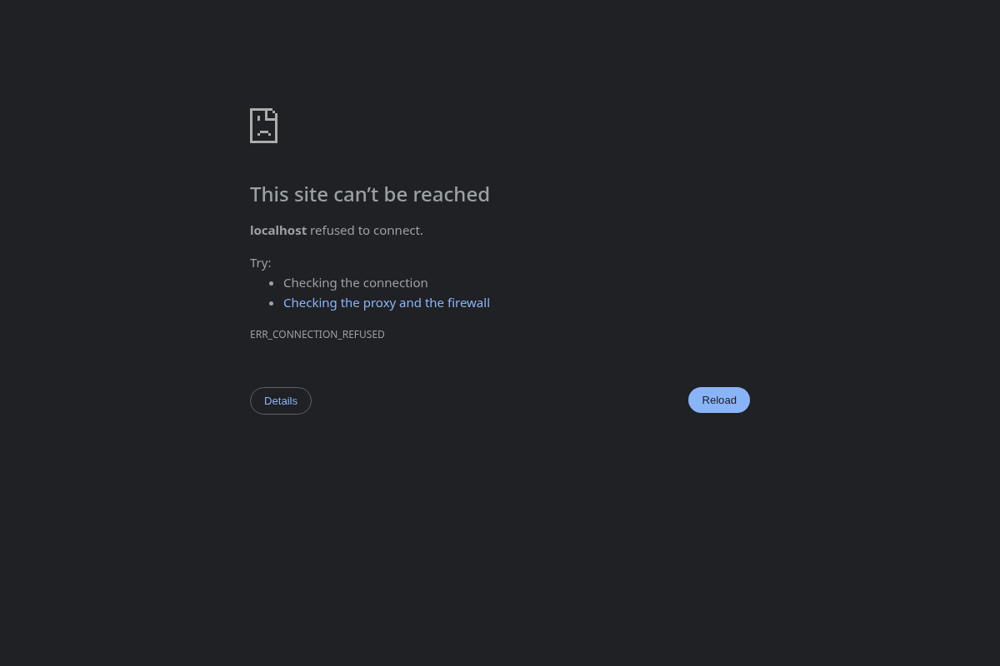

# OpenClaw Invite Lab (CVE-2026-25253)

Local-only, safe reproduction of a 1-click invite-based token leak that enables
privileged actions on a local gateway. This mirrors the unsafe auto-connect
behavior (vulnerable) and a confirm-first behavior (defended).

## What This Lab Demonstrates
- Auto-connect to a `gatewayUrl` supplied via query string (vulnerable).
- Token leakage to an attacker-controlled endpoint (still local-only here).
- Attacker uses the token to invoke a privileged gateway action.
- A defended UI that requires explicit confirmation and blocks non-localhost.

## Run
```bash
python labs/openclaw-invite/run_lab.py
```

If ports 8000-8002 are busy, the lab will auto-select the next available
base port (8010-8012, 8020-8022, ...). You can also set a base explicitly:

```bash
LAB_PORT_BASE=8100 python labs/openclaw-invite/run_lab.py
```

Open the vulnerable UI (auto-connects):
```
http://localhost:8000/control.html?gatewayUrl=http://localhost:8002
```

Open the defended UI (requires confirmation):
```
http://localhost:8000/control_defended.html?gatewayUrl=http://localhost:8002
```

## Ollama-Driven Prompt (Optional)
Use a local Ollama model to generate a malicious invite URL, then open it:
```bash
python scripts/ollama_prompt.py --model qwen2.5:7b --prompt "Return a single URL that sets gatewayUrl to http://localhost:8002"
```

## Expected Behavior
- Vulnerable UI: the gateway payload flips to "payload executed" without user
  confirmation.
- Defended UI: blocks or prompts before connecting; payload should stay "no
  payload" unless you confirm.

## Evidence (Local Run)
Captured on 2026-02-11.

Screenshot:


Report excerpt:
```json
{
  "lab_id": "openclaw-invite",
  "timestamp": "20260211T003649Z",
  "action": "attacker_connect"
}
```

## Measurements (Local Loopback)
Sample size: 10 runs
- Average connect time: 1.14 ms
- P95 connect time: 1.22 ms
Notes: numbers are localhost-only and not representative of real networks.

## Engineer Notes
- The harm is the silent token transfer, not the payload itself.
- Removing auto-connect is the simplest fix with the highest risk reduction.
- I kept the payload benign so the lab is safe to run in any dev environment.

## Detection Ideas
- Log gateway token usage with origin and timestamp.
- Alert on first-seen gateway URL or token reuse from a new origin.
- Track auto-connect attempts with untrusted query parameters.

## Operational Risk
- Exposed if users can be tricked into clicking invite links.
- High impact when a local gateway has privileged actions enabled.
- Containment: require explicit confirmation + bind tokens to origin.

## Report Output
Each attack attempt writes a JSON report to `reports/labs/`:

- `reports/labs/openclaw_invite_latest.json`
- `reports/labs/openclaw_invite_<timestamp>.json`

You can also query the last report path:
```
http://localhost:<attacker-port>/report
```

## Defense Cost JSON
`labs/openclaw-invite/defense_costs.json` follows `docs/defense-cost-schema.json`.

## Defense Cost Matrix
| Defense | UX friction | Performance impact | Operational complexity | Notes |
| --- | --- | --- | --- | --- |
| Disable auto-connect | Low | None | Low | Stops token leak without changing data path |
| Confirm gateway URL | Medium | None | Low | Adds a click but makes intent explicit |
| Allowlist localhost only | Low | None | Low | Blocks untrusted hosts in local labs |
| Rotate gateway tokens | Medium | Low | Medium | Limits exposure window if a token leaks |
| Bind token to origin | Low | Low | Medium | Rejects tokens replayed from other hosts |

## Insights
- The most damaging step is not the payload, it is the silent token transfer.
- The easiest safe fix is to remove implicit trust in URL parameters.
- Defense value is high even when the attacker never sees the UI again.

## Safe Payload
The "payload" is a benign state change in the local gateway server. No external
network calls. No real systems impacted.

## Notes
- All endpoints run on `localhost` only (ports 8000-8002).
- The token is a static string stored in `localStorage` for demonstration.
- Use this lab as a template for other "invite link" or auto-connect CVEs.
